autoscale: true
footer: 

#[fit] Version Control with Git

### Rahul Dave, Univ.Ai

This tutorial is partly based on the repository: `git@github.com:rdadolf/git-and-github.git` which was created for IACS's ac297r course, by Robert Adolf, and partly based on the UnivAI summer school training.

---

## What is Version Control

Version control is a way of tracking the change history of a project. 

Even if you have never used a version control tool, you've probably already done it manually: copying and renaming project folders ("paper-1.doc", "paper-2.doc", etc.) is a form of version control.

Git is a tool that automates and enhances a lot of the tasks that arise when dealing with larger, longer-living, and collaborative projects. 

It's also become the common underpinning to many popular online code repositories, [GitHub](https://github.com/) being the most popular.

---

## Other tutorials

- read [the Git Book](http://git-scm.com/book/en/v2). Scott Chacon and Ben Straub have done a tremendous job, and if you want to understand both the interfaces and the mechanisms behind git, this is the place to start.
- Software Carpentry [Git Tutorial](https://swcarpentry.github.io/git-novice/)

---

## Why should you use version control?

If you ask 10 people, you'll get 10 different answers, but one of the commonalities is that most people don't realize how integral it is to their development process until they've started using it. Still, for the sake of argument, here are some highlights:

- **You can undo anything:** Git provides a *complete history* of every change that has ever been made to your project, timestamped, commented, and attributed. If something breaks, you always have the choice of going back to a previous state.
- **You won't *need* to keep undo-ing things:** One of the advantages of using git properly is that by keeping new changes separate from a stable base, you tend to avoid the massive rollbacks associated with constantly tinkering with a single code.
- **You can identify exactly when and where changes were made:** Git allows you to pinpoint when a particular piece of code was changed, so finding what other pieces of code a bug might affect or figuring out why a certain expression was added is easy.
- **Git forces teams to face conflicts directly:** On a team-based project, many people are often working with the same code. By having a tool which understands when and where files were changed, it's easy to see when changes might conflict with each other. While it might seem troublesome sometimes to have to deal with conflicts, the alternative, *not knowing there's a conflict* is much more insidious.

---

## Git Basics

You can think about git operating on four different areas:


 - The **working directory** is what you're currently looking at. When you use an editor to modify a file, the changes are made to the working directory.
 - The **staging area** is a place to collect a set of changes made to your project. If you have changed three files to fix a bug, you will add all three to the staging area so that you can remember the changes as one historical entity. It is also called the **index**. You move files from the working directory to the index using the command `git add`.
 
---
 
 


 - The **local repository** is the place where git stores everything you've ever done to your project. Even when you delete a file, a copy is stored in the repo (this is necessary for always being able to undo any change). This is done in the `.git` directory in the working directory of your project. Files are moved from the index to the local repository via the command `git commit`.
 - When working in a team, every member will be working on their own local repository. An **upstream repository**, also called a **remote**, allows everyone to agree on a single version of history and submit their changes. If two people have made changes on their local repositories, they will combine those changes in the upstream repository. In our case this upstream repository is hosted by github. The standard github remote is called the **origin**. One usually moves code from local to remote repositories using `git push`, and in the other direction using `git fetch`.

---

## Git Basics

You can think about git operating on four different areas:


You can think of most git operations as moving code or metadata from one of these areas to another.

----

## Common Tasks in the version control of files.

0. Forking
1. `git clone`
2. `git log`
3. `git status`
4. `git add`
5. `git commit`
6. `git push`

----

## Important concepts in collaboration workflow

1. Forks
2. Branches
3. Pull Requests

---

### Forking a repository

Forking a repository done on github. On github, go to the url https://github.com/univai/toplay. Click the "Fork button on the upper right side. A screenshot is below. 


Forking brings a repository into your own namespace. Its really a *cloning* process (see below), but its done between two "remotes" on the server. In other words it creates a second upstream repository on the server, called the **origin**.

---

The forking process on github will either fork to your own github id on github, or ask you *where* you want to fork the repository. In that case choose your own github id. Then you will see a screen like this:


In my case I will choose `@rahuldave`. In this tutorial, wherever you see `rahuldave`, substitute your own github id.

---

This leaves me with my own repository, `rahuldave/toplay`, as seen in this image


You will get a similar page. Now that we have a **fork** of the `univai/toplay` repository, lets **clone** it down to our local machines.

---

## 1. Cloning


Cloning a repository does two things: it takes a repository from somewhere (usually an **upstream repository**) and makes a local copy (your new **local repository**), and it creates the most recent copy of all of the files in the project (your new **working directory**). This is generally how you will start working on a project for the first time.

---

```bash
rm -rf toplay 
#remove if it exists
git clone git@github.com:rahuldave/toplay 
#use https if no ssh setup
```

```
    Cloning into 'toplay'...
    remote: Enumerating objects: 14, done.
    remote: Counting objects: 100% (14/14), done.
    remote: Compressing objects: 100% (8/8), done.
    remote: Total 14 (delta 3), reused 14 (delta 3), pack-reused 0
    Receiving objects: 100% (14/14), done.
    Resolving deltas: 100% (3/3), done.
```

Lets see the contents of this new folder:

```bash
ls toplay
```
```
    LICENSE   README.md app.py    hello.md
```

---

## 2. Poking around: log


[.column]

```bash
cd toplay
git log
```
```
    commit 0b80eb4f1c4ce9aafb0a39b93f89380b4595335c
    Author: Rahul Dave <rahuldave@gmail.com>
    Date:   Fri Sep 2 16:32:54 2016 -0400

         comitted the poor fellow to an institution

    commit 62846b8b8829359722d7e4a20745aea0b1161796
    Author: Rahul Dave <rahuldave@gmail.com>
    Date:   Thu Sep 1 16:03:02 2016 -0400

        Said hello to myself

    commit 94e60ac8f57024a03e861bc34f20c65c7d8f7961
    Author: Rahul Dave <rahuldave@gmail.com>
    Date:   Thu Sep 1 15:53:55 2016 -0400

        random choices

    commit 20523188138fb29f59bf392156ac68b1764b8fd5
    Author: Rahul Dave <rahuldave@gmail.com>
    Date:   Thu Sep 1 15:46:54 2016 -0400

        Initial commit
```

[.column]

We have a nice smelling fresh repository. Lets look around it.

Each one of these "commits" is a SHA hash. It uniquely identifies all actions that have happened to this repository previously. We shall soon see how to add our own actions in. In the meanwhile, lets see the "status" of our working directory.

---

## 3. `status`


Status is your window into the current state of your project. It can tell you which files you have changed and which files you currently have in your staging area.

---

```bash
git status
```
```
    On branch master
    Your branch is up-to-date with 'origin/master'.
    nothing to commit, working tree clean
```

Pay close attention to the text above. (1) It says we are on the *master branch* of our **local repository**, and that (2) this branch is up-to-date with the *master branch* of the **upstream  repository** or **remote** named **origin**. We know this as clone brings down a copy of the remote branch:  "`origin/master`" represents the local copy of the branch that came from the upstream repository (nicknamed "`origin`" in this case). 


---

## What is a branch?


**Branches** are different, co-existing versions of your project. This sounds like a recipe for disaster, but in a sense, branches are just like commits. They represent a snapshot of the project, by someone, at some particular point in time. 

---

You are always working on a given branch in a repository. Typically this is `master`. 

You can know which branch you are on by typing `git branch [-a]`. The starred one is the one you are on.

```bash
git branch
```
```
    * master
```


---


## Making changes

Ok! Enough poking around. Lets get down to business and add some files into our folder.

Now let's say that we want to add a new file to the project. The canonical sequence is "**edit-add-commit-push**".

```bash
echo '# Hello world world' > world.md
git status
```

```
    On branch master
    Your branch is up-to-date with 'origin/master'.
    Untracked files:
      (use "git add <file>..." to include in what will be committed)

        world.md

    nothing added to commit but untracked files present (use "git add" to track)
```

We've added a file to the working directory, but it hasn't been staged yet.

---

## 4. `add`


When you've made a change to a set of files and are ready to create a commit, the first step is to add all of the changed files to the staging area. `add` does that. Remember that what you see in the filesystem is your working directory, so the way to see what's in the staging area is with the `status` command. This also means that *if you add something to the staging area and then edit it again, you'll also need to add the file to the staging area again if you want to remember the new changes*.

---

```bash
git add world.md
git status
```
```
    On branch master
    Your branch is up-to-date with 'origin/master'.
    Changes to be committed:
      (use "git reset HEAD <file>..." to unstage)

        new file:   world.md
```

Now our file is in the staging area (Index), waiting to be committed.

I will sometimes simply use `git add .` in the top level of the repository. This adds all new files and changed files to the index, and is particularly useful if I have created multiple new files.

---

## 5.`commit`


When you're satisfied with the changes you've added to your staging area, you can commit those changes to your local repository with the `commit` command. Those changes will have a permanent record in the repository from now on.

Every commit has two features you should be aware of. The first is a hash. This is a unique identifier for all of the information about that commit, including the code changes, the timestamp, and the author. The second is a commit message. This is text that you can (and should) add to a commit to describe what the changes were.

---

```bash
git commit -m "Said hello world to world"
git status
```
```
    [master 55c7b65] Said hello world to world
     1 file changed, 1 insertion(+)
     create mode 100644 world.md
    On branch master
    Your branch is ahead of 'origin/master' by 1 commit.
      (use "git push" to publish your local commits)
    nothing to commit, working tree clean
```

---

## Good commit messages are important

Commit messages are a way of quickly telling your future self (and your collaborators) what a commit was about. For even a moderately sized project, digging through tens or hundreds of commits to find the change you're looking for is a nightmare without friendly summaries.

By convention, commit messages start with a single-line summary, then an empty line, then a more comprehensive description of the changes.

[This](https://github.com/rdadolf/clangtool/commit/bdd8f1290146c28a4cb05b62ccb0ffbaaa314ff7) is an okay commit message. The changes are small, and the summary is sufficient to describe what happened.

[This](https://github.com/rdadolf/protos/commit/9fcbe1084b17027e003c62043d764ed5551ddadc) is better. The summary captures the important information (major shift, direct vs. helper), and the full commit message describes what the high-level changes were.

[This](https://github.com/rdadolf/autopaxos/commit/d43dd9b0a699c98bd142ba7cbc1836fbc4eba2ac). Don't do this.

---

## What happened on the commit?

```bash
git branch -a
```
```
    * master
      remotes/origin/HEAD -> origin/master
      remotes/origin/master
```

Now we see that our branch, "`master`", has one more commit than the "`origin/master`" branch, the local copy of the branch that came from the upstream repository (nicknamed "`origin`" in this case). Let's push the changes.

---

## 6.`push`


The `push` command takes the changes you have made to your local repository and attempts to update a remote repository with them. If you're the only person working with both of these (which is how a solo GitHub project would work), then push should always succeed.

---


```bash
git push
git status
```
```
    Counting objects: 3, done.
    Delta compression using up to 4 threads.
    Compressing objects: 100% (2/2), done.
    Writing objects: 100% (3/3), 292 bytes | 0 bytes/s, done.
    Total 3 (delta 1), reused 0 (delta 0)
    remote: Resolving deltas: 100% (1/1), completed with 1 local object.
    To github.com:rahuldave/toplay
       0b80eb4..55c7b65  master -> master
    On branch master
    Your branch is up-to-date with 'origin/master'.
    nothing to commit, working tree clean
```

----

## Collaboration with git

So far, we have acted as if you were the only person working on the software. This is fine! Version control is important for the single developer.

As you might expect, it becomes critical when you are working in a team! Here are 3 different workflows for collaborating with git.

1. Collaborating on one repository
2. Collaborating using branches and pull requests
3. Collaborating using forks and pull requests

---

## Collaborating using one repository

In this scenario, multiple people work on one repository, via a remote. 

In our case this remote is hosted on github. This is the old way revision control systems were used, and still a good choice for small teams that know each other well, and where the chances of merge conflicts are low.

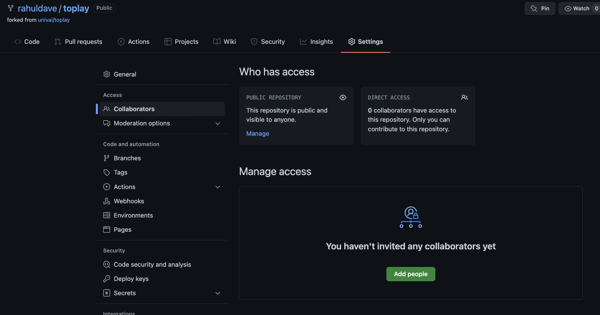

You need to add collaborators directly to your repository on github.

Now you have to be concerned with **fetching** and **merging** changes others have made.

---

## `fetch`


Let's say a collaborator has pushed changes to your shared upstream repository while you were editing. Their local repository and the upstream repository now both contain their changes, but your local repository does not. To update your local repository, you run fetch.


---

But what if you've committed changes in the meantime? Does your local repository contain your changes or theirs? The answer is that it contains a record of both, but they are kept separate.

Let's say that you and your collaborator both edited the same line of the same file at the same time in different ways. On your respective machines, you both add and commit your different changes, and your collaborator pushes theirs to the upstream repository. When you run fetch, git adds a record of their changes to your local repository alongside your own. 

These are again **branches**, and they represent different, coexisting versions of your project. The fetch command adds your collaborator's branch to your local repository, but keeps yours as well!

---

## `merge`


Having multiple branches is fine, but at some point, you'll want to combine the changes that you've made with those made by others. This is called merging.


There are two general cases when merging two branches: first, the two branches are different but the changes are in unrelated places; and second, the two branches are different and the changes are in the same locations in the same files.

---

## Scenario 1: Changes in unrelated places

The first scenario is easy. Git will simply apply both sets of changes to the appropriate places and put the resulting files into the staging area for you. Then you can commit the changes and push them back to the upstream repository. Your collaborator does the same, and everyone sees everything.

In this case you can combine `git fetch` and `git merge` together into a single command:

`git pull`

---

## Scenario 2: Changes in the same places

Let's say the two changes set some variable to different values. Git can't know which is the correct value. One solution would be to simply use the more recent change, but this very easily leads to self-inconsistent programs. A more conservative solution, and the one git uses, is to simply leave the decision to the user. When git detects a conflict that it cannot resolve, merge fails, and git places a modified version of the offending file in your project directory. This is important: the file that git puts into your directory is not actually either of the originals. It is a new file that has special markings around the locations that conflicted.

The line above the ======= belongs to your branch, and the line below belongs to the branch you're merging with. Your job is to edit this file to replace all of that block with just the correct output. For instance:

Once you have fixed the file, you can add, commit, and push the changes. When your collaborator merges your resolved version, git is smart enough to know that a merge resolution occurred and how to handle it without causing another conflict, despite the fact that your resolved version was different than either of the originals.

---

## 2. Collaborating using branches and pull requests

Branches can also be created manually, and they are a useful way of organizing unfinished changes.


`git branch branchname`

It's important to note that the other branch is not active. If you make changes, they will still apply to the master branch, not my-new-branch. To change this, you need the next command.

---

## `checkout`


Checkout switches the active branch. Since branches can have different changes, checkout may make the working directory look very different. For instance, if you have added new files to one branch, and then check another branch out, those files will no longer show up in the directory. 

`git checkout branchname`, and to switch back, `git checkout master`

---

## Working on a new branch

You can also do:

`git checkout -b branchname` . This will create the branch AND check it out. Now any changes to the working directory will be on this new branch.

Any add/commit will now be on this branch. When you want to push, you must make a slight change:

`git push -u origin branchname`

You (or a collaborator) can use this branch to develop a new feature, for example. 

---

### The process can be done on github

Github conveniently allows you to make small changes on new branches directly

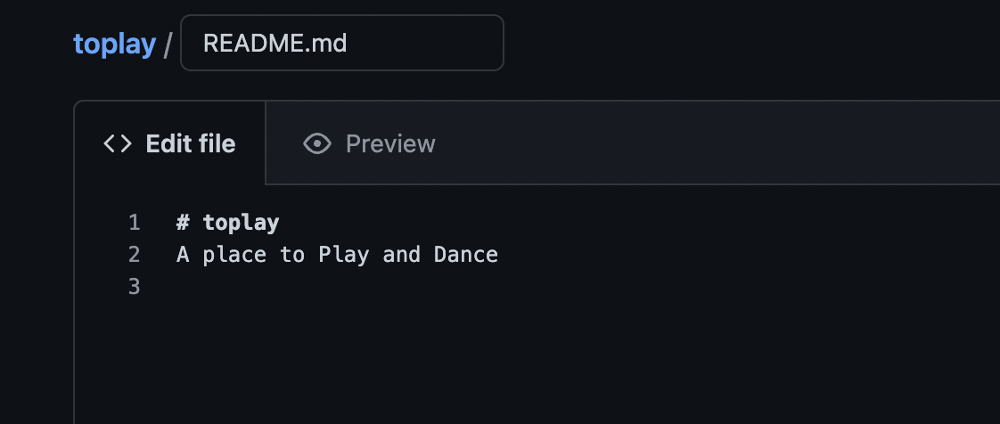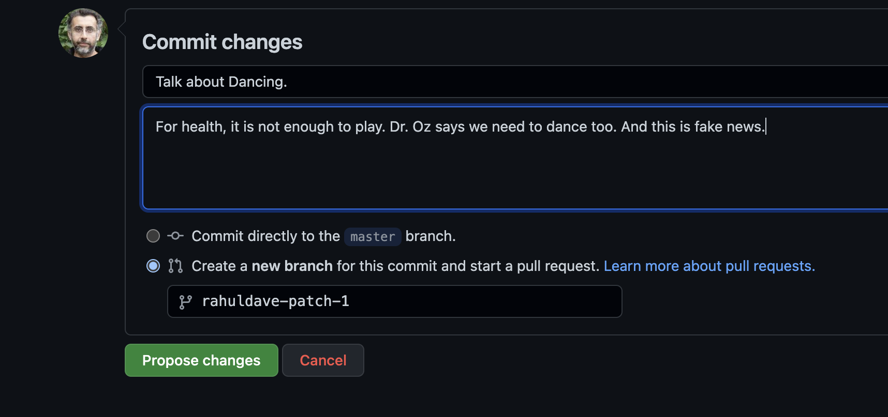

---

## Pull requests

After pushing the new branch to the origin, you can now create a "pull-request" for this branch to be merged to master.

This is done from the github user interface.

You can yourself (or a repository "admin" can) merge the changes on the branch into the master branch.

---

Now you create a pull request

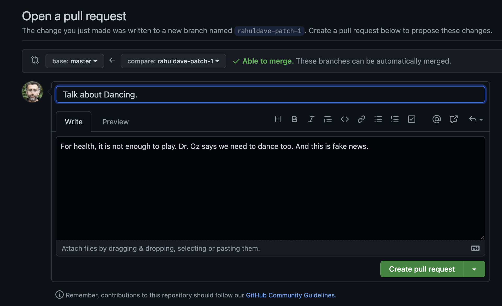

---

And you, yourself, or a collaborator, can merge this PR in.

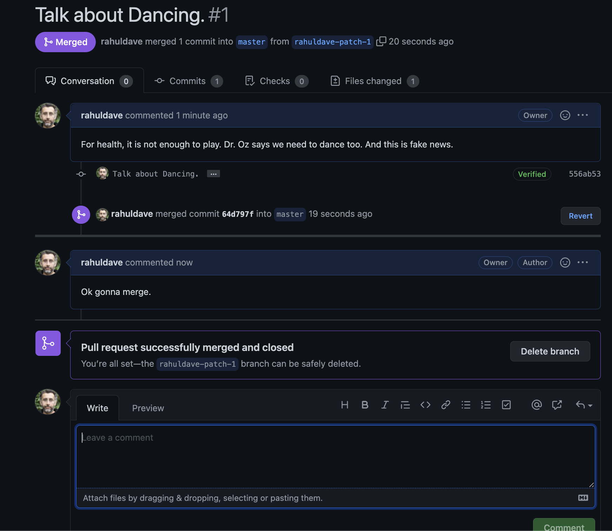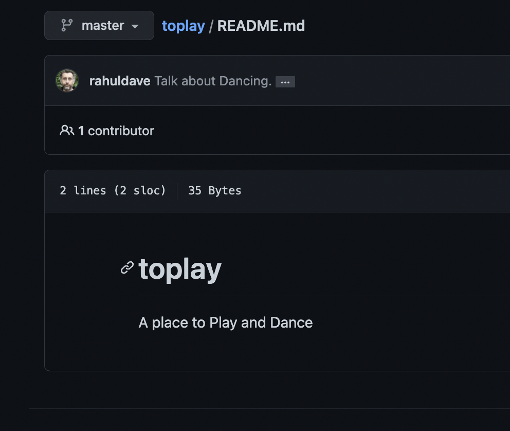

---

## 3. Collaborating using forks and pull requests

You can also make edits directly on a fork, in the master branch, and make a pull-request to the original repository you forked from.

You might even make this edit in a branch of your fork, and ask for it to be merged by the author(s) of the original repo into the master branch there.

In the example here, the changes made to `rahuldave/toplay` via a pull request from a branch to the master, now accepted to master, are sent to `univai/toplay` via a pull-request from `rahuldave/toplay` master branch to `univai/toplay` master branch.

---

First your create the PR.

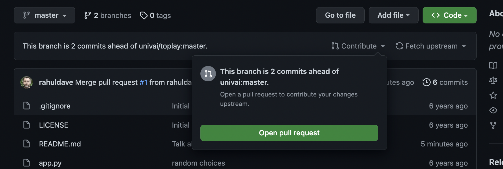

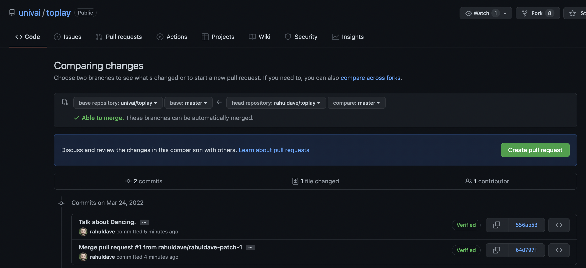

---

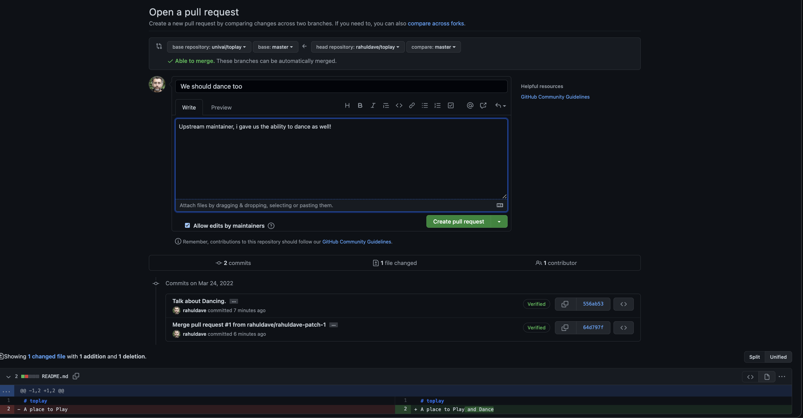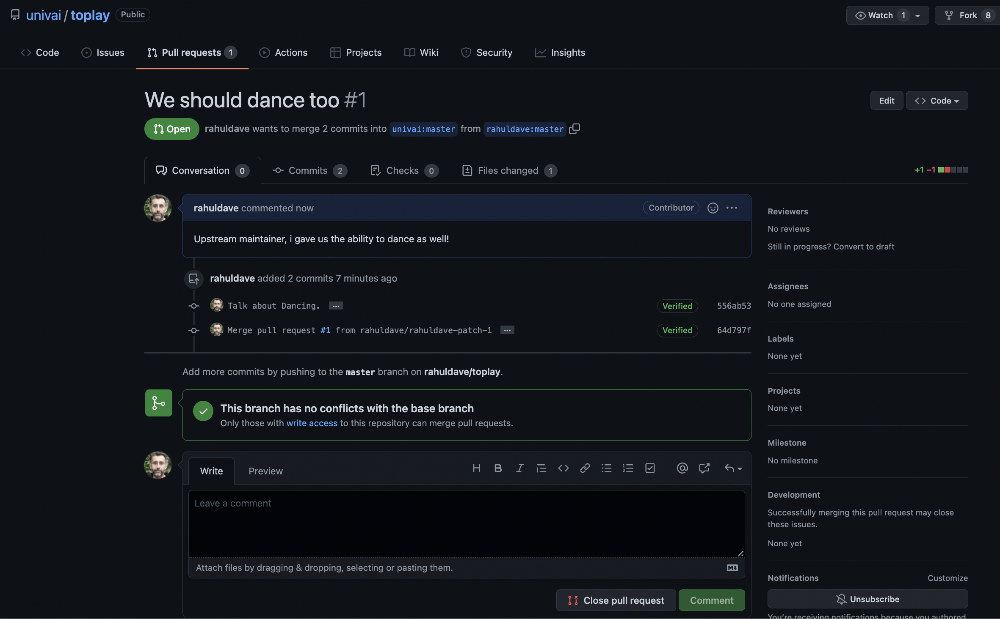

---

Then the upstream maintainer sees it:

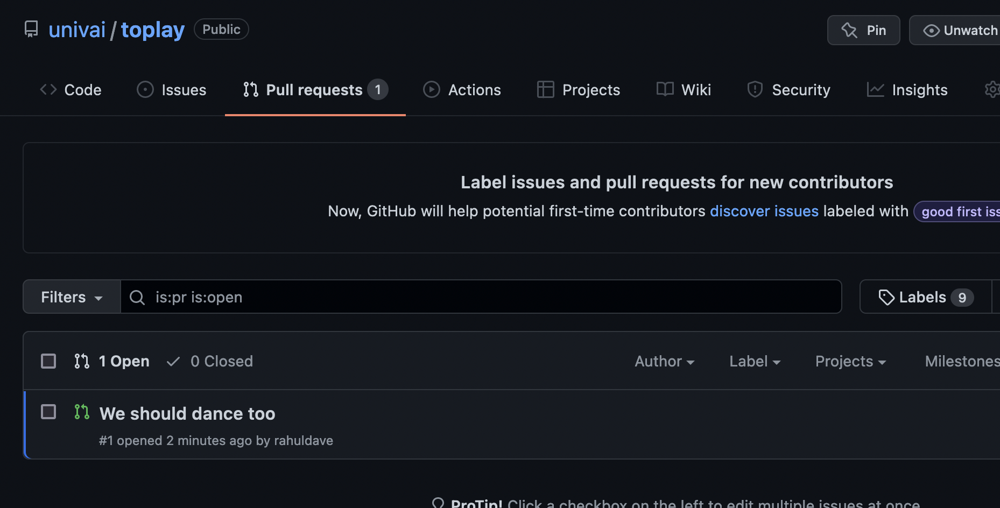

---

And then merges it:

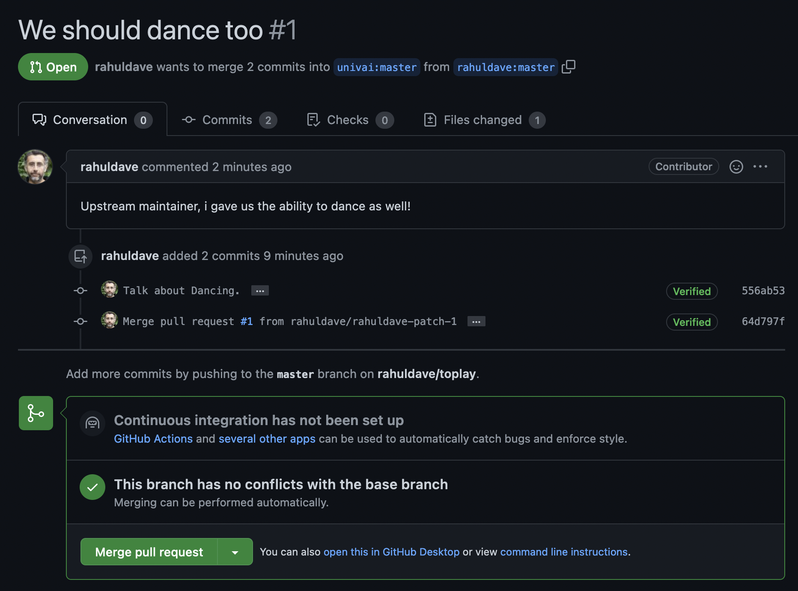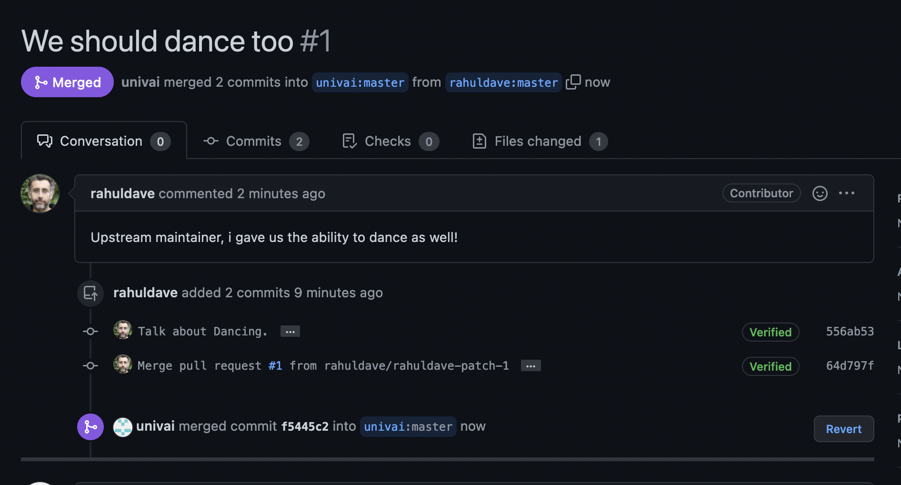

---

The changes are now upstream!

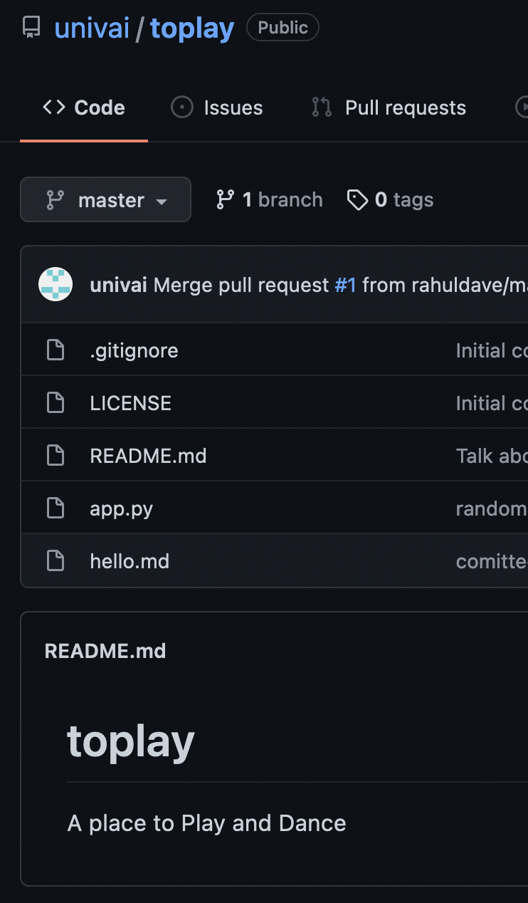

**Which of these collaboration mechanisms to use?**

Your choice, and organization policy. 

Tight groups use (1), tight Orgs use (2) quite often, and large orgs or open source projects use (3) quite often.

---

## Creating a new repository

Creating a repository can be done with git command line tools, or it can be done on github. On your github home, click on the 'Repositories' tab, then click the green 'New' button. You'll be brought to a page that asks for some basic project information.


 - The repository name needs to be unique, but only amongst *your* github repositories. Despite what github suggests, try to pick something at least a little representative of your project.
 
 - The description field is just a short text field that will accompany your repository's name on the github website.

 - If you're creating a new repository, check the "Initialize this repository with a README" box. This is a little bit of a misnomer. If you don't do this, you won't be able to clone your repository at all. Instead, you'll have to manually create a new repository on your computer and upload that to github. Suffice to say, unless you've got an existing git repository that was hosted somewhere besides github, *always check this box*.

 - You're free to click the `.gitignore` or `license` buttons, too, but there's no requirement to do so. You can easily create either later. For our class I use a python `.gitignore` from the dropdown menu

----

## Git habits

**Commit early, commit often.**

Git is more effective when used at a fine granularity. Committing lots of small changes makes it easier to find the right rollback point. Also, merging becomes a lot easier when you only have to deal with a handful of conflicts.

**Commit unrelated changes separately.**

Identifying the source of a bug or understanding the reason why a particular piece of code exists is much easier when commits focus on related changes. 

**Do not commit binaries and other temporary files.**

Git is meant for tracking changes. 

---

## Git habits

**Ignore files which should not be committed**

Git comes with a built-in mechanism for ignoring certain types of files. Placing filenames or wildcards in a `.gitignore` file placed in the top-level directory (where the `.git` directory is also located) will cause git to ignore those files when checking file status. This is a good way to ensure you don't commit the wrong files accidentally, and it also makes the output of `git status` somewhat cleaner.

**Write good commit messages**

I cannot understate the importance of this.

**Seriously. Write good commit messages.**

---

## `.gitignore`

[.column]
Finally I set us up with a `.gitignore` file, hidden in the repository folder. It tells us what files to ignore when adding files to the index, and then comitting them to the local repository. We use this file to ignore temporary data files and such when working in our repository. Folders are indicated with a `/` at the end, in which case, all files in that folder are ignored.

```bash
cat .gitignore
```

[.column]

```
    # Byte-compiled / optimized / DLL files
    __pycache__/
    *.py[cod]
    *$py.class

    # C extensions
    *.so

    # Distribution / packaging
    .Python
    env/
    build/
    develop-eggs/
    dist/
    downloads/
    eggs/
    .eggs/
    lib/
    lib64/
    parts/
    sdist/
    var/
    *.egg-info/
    .installed.cfg
    *.egg

    ...
```

---

## How does git store info?

Configuration Information is stored in a special file `config`, in a hidden folder called `.git` in your working directory. (The index and the local repository are stored there as well...more on that in  a bit)

```bash
cat .git/config
```
```
    [core]
        repositoryformatversion = 0
        filemode = true
        bare = false
        logallrefupdates = true
        ignorecase = true
        precomposeunicode = true
    [remote "origin"]
        url = git@github.com:rahuldave/toplay
        fetch = +refs/heads/*:refs/remotes/origin/*
    [branch "master"]
        remote = origin
        merge = refs/heads/master
```

Notice that this file tells us about a remote called "origin" which is simply the github repository we cloned from. So the process of cloning left us with a remote. The file also tells us about a branch called "master", which "tracks" a remote branch valled master at "origin". 

